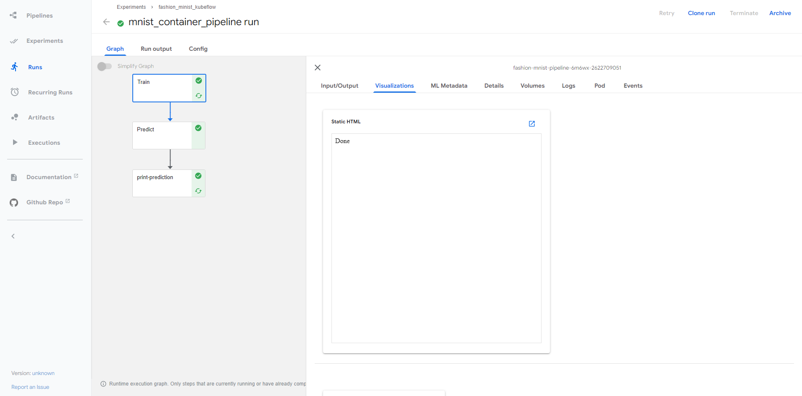
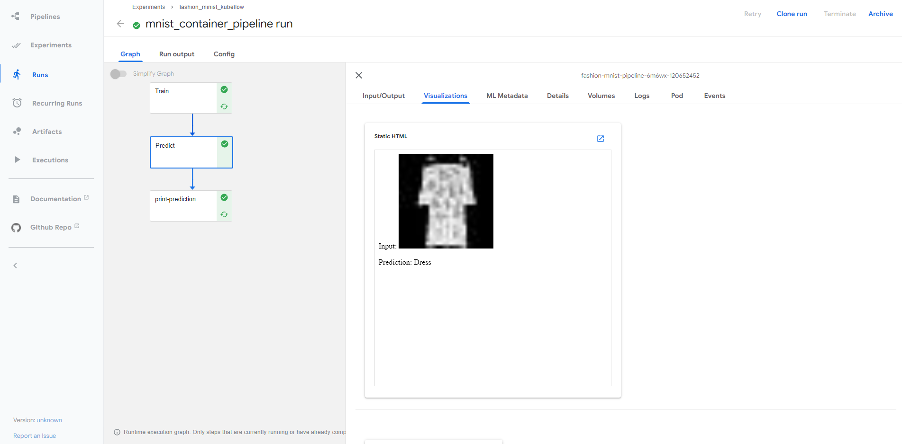
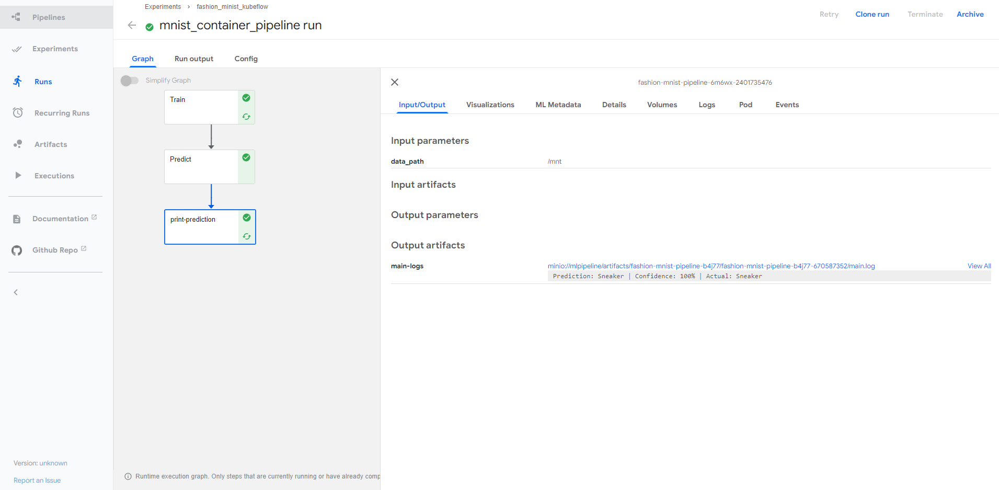
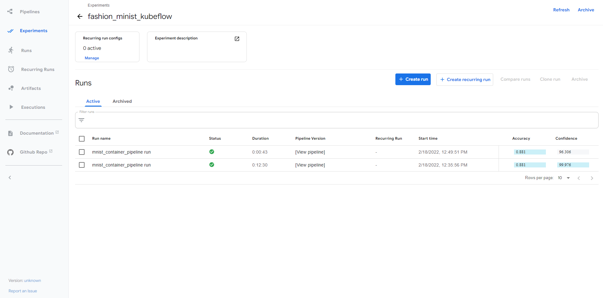

# Kubeflow GPU Pipeline

In this notebook, we are building a Kubeflow pipeline whihch will use the GPU to train the model.


### Classify Clothing

The Fashion MNIST dataset contains 70,000 grayscale images in 10 clothing categories. Each image is 28x28 pixels in size.
You might have seen this example before as it's a popular classifier, well suited to learning how to use Tensorflow and machine learning.


<b>Steps:</b>

* Create a PVC.
* Copy required files to PVC.
* Submit the pipeline from notebook.


First 2 step you need to perfrom before executing the notebook on k8s master host.

### Create PVC

This step we need to perfrom using the kubectl.

Content of fashion-mnist-pvc.yaml

```
apiVersion: v1
kind: PersistentVolumeClaim
metadata:
  name: fashion-mnist-pvc
spec:
  accessModes:
  - ReadWriteMany
  resources:
    requests:
      storage: 2Gi
```

Create a pvc using kubectl.
```
kubectl create -f fashion-mnist-pvc.yaml -n kubeflow
```


### Copy required files to PVC.

For copying the required files, first we need to download required file and then we need to copy those files to PV using a utility pod.

you can download required files from below public links:
* https://raw.githubusercontent.com/zalandoresearch/fashion-mnist/master/data/fashion/t10k-images-idx3-ubyte.gz
* https://raw.githubusercontent.com/zalandoresearch/fashion-mnist/master/data/fashion/t10k-labels-idx1-ubyte.gz
* https://raw.githubusercontent.com/zalandoresearch/fashion-mnist/master/data/fashion/train-images-idx3-ubyte.gz
* https://raw.githubusercontent.com/zalandoresearch/fashion-mnist/master/data/fashion/train-labels-idx1-ubyte.gz

<b>Commands:</b>
```
export http_proxy=http://web-proxy.corp.hpecorp.net:8080
export https_proxy=http://web-proxy.corp.hpecorp.net:8080
wget https://raw.githubusercontent.com/zalandoresearch/fashion-mnist/master/data/fashion/t10k-images-idx3-ubyte.gz
wget https://raw.githubusercontent.com/zalandoresearch/fashion-mnist/master/data/fashion/t10k-labels-idx1-ubyte.gz
wget https://raw.githubusercontent.com/zalandoresearch/fashion-mnist/master/data/fashion/train-images-idx3-ubyte.gz
wget https://raw.githubusercontent.com/zalandoresearch/fashion-mnist/master/data/fashion/train-labels-idx1-ubyte.gz
```


<b>Content of utility pod.yaml</b>

```
apiVersion: v1
kind: Pod
metadata:
    name: dataaccess
spec:
    containers:
    - name: alpine
      image: alpine:latest
      command: ['sleep', 'infinity']
      volumeMounts:
      - name: mypvc
        mountPath: /data
    volumes:
    - name: mypvc
      persistentVolumeClaim:
        claimName: fashion-mnist-pvc
```

<b>Create a pod.</b>
```
kubectl create -f pod.yaml -n kubeflow
```


<b>Copy downloaded files to PVC using pod.</b>
```
kubectl cp t10k-images-idx3-ubyte.gz dataaccess:/data -n kubeflow
kubectl cp t10k-labels-idx1-ubyte.gz dataaccess:/data -n kubeflow
kubectl cp train-images-idx3-ubyte.gz dataaccess:/data -n kubeflow
kubectl cp train-labels-idx1-ubyte.gz dataaccess:/data -n kubeflow
```

### Import required Python packages


```python
import kfp
import kfp.dsl as dsl
import kfp.components as comp
from typing import NamedTuple
from kfp import onprem
import random
```

### Ignore this step if you are running from Kubeflow Notebook


```python
from ezmllib.kubeflow.ezkfp import KfSession
K = KfSession()
client=K.kf_client()
```

### Training
train() is python based function which will be used to train our model on GPU and read the dataset files from PVC.


```python
def train(data_path, model_file)-> NamedTuple('output', [('mlpipeline_ui_metadata', 'UI_metadata'), ('mlpipeline_metrics', 'Metrics')]):
    
    import pickle
    import json, os, gzip
    import tensorflow as tf
    import numpy as np
    from tensorflow.python import keras
    
    
    #Loading dataset offline
    data_folder = f'{data_path}'
    files = [
        'train-labels-idx1-ubyte.gz','train-images-idx3-ubyte.gz',
        't10k-labels-idx1-ubyte.gz','t10k-images-idx3-ubyte.gz'
    ]
    paths = []
    for fname in files:
        paths.append(os.path.join(data_folder,fname))
        
    with gzip.open(paths[0],'rb') as lbpath:
        y_train = np.frombuffer(lbpath.read(),np.uint8,offset=8)
        
    with gzip.open(paths[1],'rb') as imgpath:
        X_train = np.frombuffer(imgpath.read(),np.uint8,offset=16).reshape(len(y_train),28,28)
    
    with gzip.open(paths[2],'rb') as lbpath:
        y_test = np.frombuffer(lbpath.read(),np.uint8,offset=8)
        
    with gzip.open(paths[3],'rb') as imgpath:
        X_test = np.frombuffer(imgpath.read(),np.uint8,offset=16).reshape(len(y_test),28,28)
   
    
    #with tf.device('/GPU:0'):
    # Download the dataset and split into training and test data from internet. 
    #fashion_mnist = keras.datasets.fashion_mnist
    #(train_images, train_labels), (test_images, test_labels) = fashion_mnist.load_data()
    
    (train_images, train_labels), (test_images, test_labels) = (X_train,y_train),(X_test,y_test)
        
        
    # Normalize the data so that the values all fall between 0 and 1.
    train_images = train_images / 255.0
    test_images = test_images / 255.0
        
        # Define the model using Keras.
    model = keras.Sequential([
            keras.layers.Flatten(input_shape=(28, 28)),
            keras.layers.Dense(128, activation='relu'),
            keras.layers.Dense(10)
        ])

    model.compile(optimizer='adam',
                  loss=keras.losses.SparseCategoricalCrossentropy(from_logits=True),
                  metrics=['accuracy'])
        
    # Run a training job with specified number of epochs
    model.fit(train_images, train_labels, epochs=10)
        
    # Evaluate the model and print the results
    test_loss, test_acc = model.evaluate(test_images,  test_labels, verbose=2)
    print('Test accuracy:', test_acc)
        
    # Save the model to the designated 
    model.save(f'{data_path}/{model_file}')
        
        
    # Save the test_data as a pickle file to be used by the predict component.
    with open(f'{data_path}/test_data', 'wb') as f:
        pickle.dump((test_images,test_labels), f)
            
    metadata = {
            'outputs' : [{'type': 'web-app',
                          'storage': 'inline',
                          'source': "<div>Done</div>",
                         }]
        }
        
    metrics = {
            'metrics': [{
                'name': 'Accuracy',
                'numberValue':  float(test_acc),
            }, {
                'name': 'Loss',
                'numberValue':  float(test_loss),
            }]}
        
    from collections import namedtuple
    print_output = namedtuple('output', ['mlpipeline_ui_metadata', 'mlpipeline_metrics'])
    return print_output(json.dumps(metadata), json.dumps(metrics))
```

### Prediction 
predict() is python based function which will be used to predict the type of image from the dataset.


```python
def predict(data_path, model_file, image_number)-> NamedTuple('output', [('mlpipeline_ui_metadata', 'UI_metadata'), ('mlpipeline_metrics', 'Metrics')]):
    
    import pickle
    import json, os, gzip
    
    import base64
    from PIL import Image
    from io import BytesIO

    import tensorflow as tf
    from tensorflow import keras

    import numpy as np
    
    # Load the saved Keras model
    model = keras.models.load_model(f'{data_path}/{model_file}')

    # Load and unpack the test_data
    with open(f'{data_path}/test_data','rb') as f:
        test_data = pickle.load(f)
    # Separate the test_images from the test_labels.
    test_images, test_labels = test_data
    # Define the class names.
    class_names = ['T-shirt/top', 'Trouser', 'Pullover', 'Dress', 'Coat',
                   'Sandal', 'Shirt', 'Sneaker', 'Bag', 'Ankle boot']

    # Define a Softmax layer to define outputs as probabilities
    probability_model = tf.keras.Sequential([model, 
                                            tf.keras.layers.Softmax()])

    # See https://github.com/kubeflow/pipelines/issues/2320 for explanation on this line.
    image_number = int(image_number)

    # Grab an image from the test dataset.
    selected_image = test_images[image_number]

    # Add the image to a batch where it is the only member.
    img = (np.expand_dims(selected_image,0))

    # Predict the label of the image.
    predictions = probability_model.predict(img)

    # Take the prediction with the highest probability
    prediction = np.argmax(predictions[0])

    # Retrieve the true label of the image from the test labels.
    true_label = test_labels[image_number]
    
    class_prediction = class_names[prediction]
    confidence = 100*np.max(predictions)
    actual = class_names[true_label]
    
    
    with open(f'{data_path}/result.txt', 'w') as result:
        result.write(" Prediction: {} | Confidence: {:2.0f}% | Actual: {}".format(class_prediction,
                                                                                confidence,
                                                                                actual))

    PIL_image = Image.fromarray(np.uint8(selected_image * 255)).convert('RGB')                                                                            
    buffered = BytesIO()
    PIL_image.save(buffered, format="JPEG")
    img_str = base64.b64encode(buffered.getvalue()).decode()
    metadata = {
        'outputs' : [{
          'type': 'web-app',
          'storage': 'inline',
          'source': '''<div>Input: </div><p>Prediction: {}</p>'''.format(img_str, actual),
        }]
      }
    
    metrics = {
      'metrics': [{
          'name': 'Confidence',
          'numberValue': confidence,
        }]}

    from collections import namedtuple
    print_output = namedtuple('output', ['mlpipeline_ui_metadata', 'mlpipeline_metrics'])
    return print_output(json.dumps(metadata), json.dumps(metrics))
```

### Python function-based component


```python
train_op = comp.func_to_container_op(train, base_image='devsds/tensorflow:latest-gpu')
predict_op = comp.func_to_container_op(predict, base_image='devsds/tensorflow:latest-gpu')
```

### Defining variable required for the pipeline.


```python
# PVC name 
PVC_NAME = 'fashion-mnist-pvc'

# Path where dataset files are stored.
DATA_PATH = '/mnt'

# Model file name.
MODEL_PATH='mnist_model.h5'

# An integer representing an image from the test set that the model will attempt to predict the label for.
IMAGE_NUMBER =  random.randint(0,100)
```

### Kubeflow Pipeline
A pipeline that performs fashion MNIST model training and prediction.


```python
# Define the pipeline
@dsl.pipeline(
   name='Fashion MNIST Pipeline',
   description='A pipeline that performs fashion MNIST model training and prediction.'
)

# Define parameters to be fed into pipeline
def mnist_container_pipeline(
    data_path: str = DATA_PATH,
    model_file: str = MODEL_PATH, 
    image_number: int = IMAGE_NUMBER
):
    
    
    # 2. Create MNIST training component.
    mnist_training_container = train_op(data_path, model_file) \
                                    .apply(onprem.mount_pvc(PVC_NAME, 'local-storage', DATA_PATH)).set_gpu_limit(1)

    # 3. Create MNIST prediction component.
    mnist_predict_container = predict_op(data_path,
                                         model_file,
                                         image_number
                                         ) \
                                    .apply(onprem.mount_pvc(PVC_NAME, 'local-storage', DATA_PATH)).set_gpu_limit(1)
    
    mnist_predict_container.after(mnist_training_container)
    
    # 4. Print the result of the prediction
    mnist_result_container = dsl.ContainerOp(
        name="print_prediction",
        image='library/bash:4.4.23',
        arguments=['cat', f'{data_path}/result.txt']
    ).apply(onprem.mount_pvc(PVC_NAME, 'local-storage', DATA_PATH))
    
    mnist_result_container.after(mnist_predict_container)

```


```python
pipeline_func = mnist_container_pipeline
experiment_name = 'fashion_minist_kubeflow'
run_name = pipeline_func.__name__ + ' run'

arguments = {
    "data_path":DATA_PATH,
    "model_file":MODEL_PATH,
    "image_number": IMAGE_NUMBER
}

```

## If you are running pipeline from Kubedirector Notebook.


```python
from ezmllib.kubeflow.ezkfp import KfSession
K = KfSession()
client=K.kf_client()
client.create_run_from_pipeline_func(
    pipeline_func, 
    experiment_name=experiment_name, 
    run_name=run_name, 
    arguments=arguments)
```

## If you are running pipeline from Kubeflow Notebook.


```python

kfp.Client().create_run_from_pipeline_func(
    pipeline_func, 
    experiment_name=experiment_name, 
    run_name=run_name, 
    arguments=arguments)
```


# Training:



# Predcition:



# Predcition in Text:



# Model Metrics:



